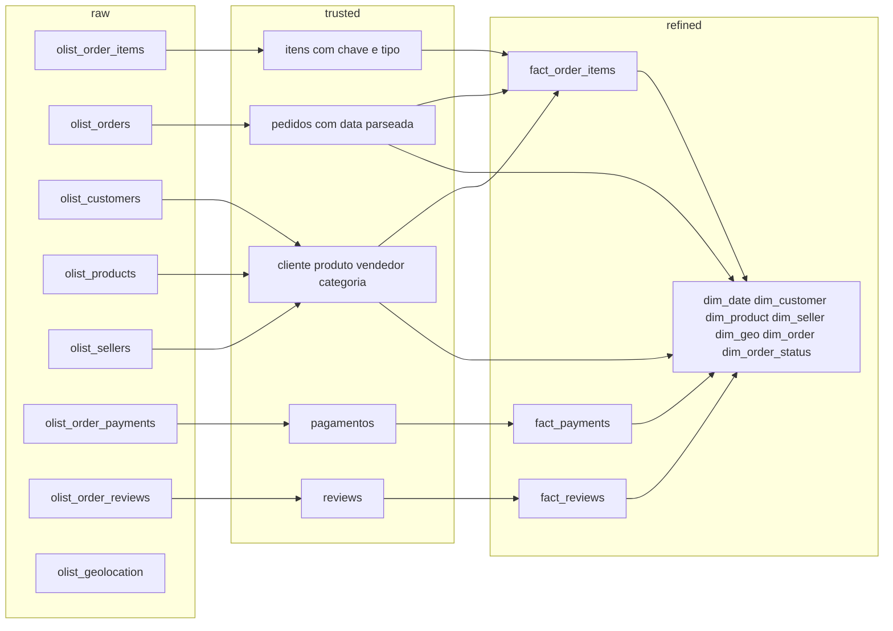

# Modelagem Kimball

Rascunho do item 6, no papel. A materialização na Dadosfera fica para depois da carga, da qualidade e das features de LLM.

A tabela larga `data/processed/fact_order_items.csv` (112.650 linhas) é o arquivo da Coleta. Ela já junta item, pedido, cliente, produto e vendedor para passar do corte de 100.000 e para explorar. O modelo abaixo é a forma analítica dessa mesma história: fatos finos e dimensões com os atributos.

## Por que estrela

O cliente é um marketplace que quer análise descritiva e prescritiva self-service: categoria, tempo, geografia e pagamento, com pouca espera entre a pergunta e o gráfico. A estrela (Kimball) é o caminho mais curto até o Metabase. Cada pergunta do item 7 vira um `GROUP BY` numa fato, com filtro em dimensão.

Data Vault serviria para auditorar a integração de várias fontes, com hubs, links e satélites. Nesta prova de conceito a fonte transacional é uma só (Olist) e o gargalo é decisão de negócio, não rastreio de carga. Vault ficaria maior do que o problema e atrasaria o dashboard. A trilha `raw` → `trusted` → `refined` já guarda a procedência sem esse custo.

## Grãos que não se misturam

Três eventos diferentes, três fatos. Juntar antes de agregar duplica receita, frete ou nota.

| Fato | Grão | Linhas | O que mede |
| --- | --- | --- | --- |
| `fact_order_items` | `order_id` + `order_item_id` | 112.650 | Venda do item |
| `fact_payments` | `order_id` + `payment_sequential` | 103.886 | Meio de pagamento do pedido |
| `fact_reviews` | `review_id` | 99.224 | Avaliação do pedido |

`fact_payments` apoia a visão comercial. Não é uma terceira visão final: `payment_value` não se soma com `price`. O review é do pedido, não do item. Um pedido com três itens tem um review; levar `dim_product` para dentro de `fact_reviews` triplicaria a nota.

O CSV de itens não tem coluna de quantidade. Cada linha já é uma unidade. O mesmo produto no mesmo pedido aparece com `order_item_id` 1, 2, 3. Quantidade é a contagem de linhas do grão.

## Visão 1 — Comercial / experiência de compra

Usada no item 7 para receita por categoria, série temporal, ticket por UF e atraso de entrega.

**Fato `fact_order_items`**

| Papel | Coluna |
| --- | --- |
| Chave do grão | `order_id`, `order_item_id` |
| Chaves estrangeiras | `date_key` (data da compra), `customer_key`, `product_key`, `seller_key`, `geo_key`, `order_status_key` |
| Métricas aditivas | `price`, `freight_value` |
| Métrica derivada | `ticket_item` = `price` + `freight_value` |
| Degenerada | `order_id` (para chegar em `dim_order` e em `fact_reviews` sem multiplicar linha) |

`date_key` nasce de `order_purchase_timestamp`. É a data da série temporal. As outras datas (aprovação, postagem, entrega, prazo, limite de envio) ficam em `dim_order`, porque descrevem o pedido, não um segundo calendário de venda.

**Dimensões**

| Dimensão | Grão | Atributos nesta PoC |
| --- | --- | --- |
| `dim_date` | um dia | ano, mês, ano-mês |
| `dim_customer` | `customer_unique_id` | o cliente real. `customer_id` da Olist é um id por pedido e fica na fato como degenerada |
| `dim_product` | `product_id` | categoria em português e em inglês, peso, dimensões, quantidade de fotos. Depois: título, descrição e features de LLM |
| `dim_seller` | `seller_id` | cidade, UF e prefixo de CEP do vendedor |
| `dim_geo` | UF + cidade do cliente | prefixo de CEP. Lat/long entram só se `dim_geo_br` for construída; o CSV cru de 1.000.163 CEPs não é esta dimensão |
| `dim_order_status` | status | `delivered`, `shipped`, `canceled`, e os demais valores de `order_status` |
| `dim_order` | `order_id` | status, timestamps de compra, aprovação, postagem, entrega e prazo estimado. Serve também à visão 2 |

Receita é a soma de `price`. Ticket do item é a média de `ticket_item`. Ticket do pedido é a soma de `ticket_item` por `order_id`, e só então a média entre pedidos. Somar `price` depois de um join com pagamentos ou reviews infla o número.

**Fato de apoio `fact_payments`**

| Papel | Coluna |
| --- | --- |
| Chave do grão | `order_id` + `payment_sequential` |
| Chaves estrangeiras | `date_key` (mesma data de compra do pedido), `payment_type_key` |
| Métricas | `payment_value`, `payment_installments` |

Perguntas de meio de pagamento e de parcelas usam esta fato, filtrando pelo mesmo `order_id` da visão comercial. `payment_value` responde “como pagou”. `price` responde “quanto o item custou”.

## Visão 2 — Qualidade da jornada / review

Usada no item 7 para a distribuição de `review_score`. Cruzamento com categoria passa pela visão 1 (`order_id`), sem copiar a nota para cada item.

**Fato `fact_reviews`**

| Papel | Coluna |
| --- | --- |
| Chave do grão | `review_id` |
| Chaves estrangeiras | `date_key` (data de criação do review), `customer_key`, `order_key` |
| Métricas | `review_score` (1 a 5) |
| Derivadas | `response_time_hours` = resposta − criação; `has_comment` = 1 quando há título ou mensagem |
| Texto | `review_comment_title`, `review_comment_message` (fonte de texto; não entra no gráfico de nota) |

99.224 reviews ficam abaixo do corte de 100.000. Esta fato não é o dataset principal da Coleta. A fato que cumpre o corte é `fact_order_items`.

## O que cada visão responde no item 7

| Pergunta | Visão | Gráfico |
| --- | --- | --- |
| Receita por categoria | Comercial, `fact_order_items` + `dim_product` | Barra |
| Receita ou pedidos por mês | Comercial, `fact_order_items` + `dim_date` | Linha |
| Distribuição de `review_score` | Jornada, `fact_reviews` | Histograma ou pizza |
| Ticket médio por UF | Comercial, `fact_order_items` + `dim_geo` | Tabela ou mapa |
| Atraso de entrega contra categoria ou feature de LLM | Comercial, `fact_order_items` + `dim_order` + `dim_product` | Barras empilhadas ou dispersão |

## Buracos que a `trusted` precisa tratar

Conferidos no join de 22/09/2026. O modelo não os esconde.

- 1.603 itens sem `product_category_name` no arquivo da Coleta. Em `data/trusted/fact_order_items.csv` a categoria vira `sem_categoria`, sem descartar a linha.
- 24 itens em `pc_gamer` e `portateis_cozinha_e_preparadores_de_alimentos` continuam sem linha na tabela oficial de tradução. Na trusted, o inglês ficou `gaming_pc` (9) e `portable_kitchen_and_food_preparers` (15).
- Reviews com quebra de linha dentro do comentário. A contagem oficial é 99.224 registros, não o número de linhas físicas do CSV.

## Camadas

`olist_geolocation` permanece em `raw`. Só entra em `refined` se a dimensão `dim_geo` ganhar lat/long numa etapa própria. Ela não passa pela fato de 112.650 linhas.

O script `scripts/build_fact_order_items.py` materializa o caminho do item até a tabela larga da Coleta. As fatos e dimensões desta página são o desenho da zona `refined`, ainda não carregado na plataforma.
