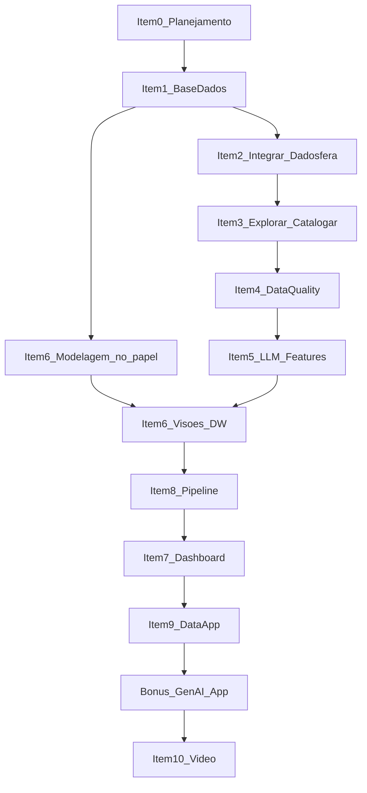

# Planejamento — Case Técnico Dadosfera (nível Excelente)

Roteiro operacional do case: o que fazer, em qual ordem, com qual base e o que precisa estar pronto para a entrega no GitHub e no vídeo.

- **Nível-alvo:** Excelente (itens 2, 3, 4 e 7 + vídeo do item 10 + Data App Streamlit do item 9 + bônus GenAI/DALL-E).
- **Itens que também entram:** 0, 1, 5, 6 e 8 — o vídeo e o Data App dependem deles.
- **Mês/ano da entrega:** 09/2026.
- **Repositório:** `PRIMEIRO_ULTIMO_DDF_TECH_092026` (trocar pelo nome real).
- **Fonte do enunciado:** [Case Técnico Base v2.2](https://docs.google.com/document/d/e/2PACX-1vQXYFQxoKXJV3Xk6gnFSz6nOhBnrbzKqJc6oflBsnIDv8DthINIKZN3tGN5mRa3SzX2hUq6qgt70Etb/pub).

---

## 1. Objetivo e narrativa

O case é uma prova de conceito de que a Dadosfera é o caminho mais rápido entre dados e valor. O cliente é um **marketplace/e-commerce brasileiro** que quer análises descritivas e prescritivas com mais agilidade e menor custo, em todas as áreas, e **modelos de IA para melhorar a experiência de compra**.

**Problema:** pedidos, clientes, produtos e textos (títulos, descrições, reviews) estão espalhados; a qualidade é irregular; não há features estruturadas extraídas do catálogo; decisões de sortimento, logística e marketing demoram.

**Solução PoC na Dadosfera (um fio só):**

1. Integrar pedidos + catálogo (+ reviews).
2. Catalogar em zonas de Data Lake (`raw` → `trusted` → `refined`).
3. Medir e corrigir qualidade (Great Expectations).
4. Extrair features de texto com LLM (categoria, material, público, atributos).
5. Modelar em estrela (Kimball) com duas visões finais.
6. Publicar dashboard (categorias + série temporal + pelo menos 5 visualizações).
7. Operacionalizar limpeza + features + modelo em um pipeline catalogado.
8. Entregar Data App de exploração/similaridade (Streamlit).
9. Entregar gerador de apresentação de produto (DALL-E).
10. Apresentar a PoC em vídeo, como especialista de dados da Dadosfera.

---

## 2. Pré-requisitos (antes de começar a implementar)

- [ ] Acesso ao ambiente de treinamentos da Dadosfera (e-mail da vaga; buscar `from: suporte@dadosfera.ai`).
- [ ] Conta GitHub; se o repo for privado, convidar `allansene`, `Rafaelsantanaep`, `galvsoliveira`, `Guilherme-maioli`, `edvaldoazevedo`.
- [ ] Conta Google (Colab) e, se for publicar o app, Streamlit Community Cloud.
- [ ] Chave de API de LLM (OpenAI ou equivalente) para o item 5 e o bônus DALL-E.
- [ ] Conta Kaggle (download do Olist) e, opcional, projeto no Google Cloud para BigQuery/IBGE.
- [ ] Conta YouTube para vídeo unlisted.
- [ ] Pasta local de prints (`docs/prints/`) já criada para evidências.

Não compartilhar o usuário da Dadosfera com outra pessoa.

---

## 3. Decisão da base de dados

### 3.1 Escolha oficial deste case

**Combo: Olist (transacional) + texto de produto/reviews + sintético de reforço.**

**Fato oficial:** `olist_order_items_dataset` (grão = item de pedido). Contagem conferida no CSV em `data/raw/`: **112.650 registros**, acima do corte de 100.000. `olist_orders_dataset` tem 99.441 pedidos e fica abaixo do corte, então não pode ser a fato nem a única tabela carregada.

**O que sobe na Coleta:** `data/trusted/fact_order_items.csv` (112.650 linhas). É a fato enriquecida depois da correção de categoria. O arquivo `data/processed/fact_order_items.csv` fica só como evidência do buraco, e o CSV cru `olist_geolocation_dataset` (1.000.163 CEPs) fica de fora. Roteiro da carga: `docs/carga_dadosfera.md`.

| Camada | Fonte | Papel no case |
| --- | --- | --- |
| Transacional | [Brazilian E-Commerce Public Dataset by Olist](https://www.kaggle.com/datasets/olistbr/brazilian-ecommerce) | Pedidos, itens, clientes, vendedores, pagamentos, frete, geo. Narrativa BR. Base **não listada** no enunciado → bônus de criatividade. |
| Fato (≥ 100k) | `olist_order_items_dataset` (112.650 linhas) | Uma linha por item de pedido, com `price` e `freight_value`. Chave do grão: `order_id` + `order_item_id`. |
| Texto / GenAI | Nome/categoria do produto Olist + **descrições geradas** (script) e/ou `olist_order_reviews` | Item 5: título + descrição → features JSON. Reviews entram como segundo texto. |
| Folga de volume e geo | Script sintético (mais itens/pedidos, lat/long, municípios) | Cobre o bônus de geo do item 7. O corte de 100k já está garantido pela fato, sem o sintético. Script **obrigatório** no repo se o sintético for usado. |

**Regra de ouro:** a tabela enviada à Dadosfera para avaliação precisa ter **pelo menos 100.000 registros**. A fato crua já passa (112.650). O join em `scripts/build_fact_order_items.py` foi recontado: `data/processed/fact_order_items.csv` continua com **112.650** linhas. O log está em `data/README.md`.

### 3.2 Por que não só Kaggle

Kaggle é o ponto de download do Olist. O case fica mais forte se o texto (descrições) e o volume extra nascerem de um **script versionado** no repositório, com opção de enriquecer com Hugging Face, BigQuery ou IBGE.

### 3.3 Alternativas (só se a escolha oficial travar)

| Alternativa | Onde | Quando usar | Risco |
| --- | --- | --- | --- |
| The Look eCommerce | [BigQuery public datasets](https://console.cloud.google.com/marketplace/product/bigquery-public-data/thelook-ecommerce) | Precisar de volume folgado e schema de e-commerce pronto | Menos “brasileiro”; enriquecer geo à parte |
| Online Retail II | [UCI](https://archive.ics.uci.edu/dataset/502/online+retail+ii) | Quiser ~1M de transações rápido | Descrições curtas; GenAI fica pobre |
| Amazon Products / Reviews | [Hugging Face Datasets](https://huggingface.co/datasets) / UCSD | Quiser o melhor casamento com o exemplo do item 5 | Precisa juntar com uma fato de pedidos |
| Instacart Market Basket | Kaggle | Quiser milhões de pedidos | Texto fraco (só nome de produto) |
| 100% sintético (Faker + LLM) | Script próprio | Quiser domínio muito específico | Tudo depende da qualidade do gerador |

**Não preferir** AdventureWorks nem NYC Taxi como base principal: o próprio case já sugere, então não dão bônus de criatividade. Servem só como fallback.

### 3.4 Onde buscar dados (além do Kaggle)

- [Hugging Face Datasets](https://huggingface.co/datasets) — texto, reviews, catálogos.
- [Google BigQuery Public Datasets](https://cloud.google.com/bigquery/public-data) — The Look, NYC Taxi.
- [UCI Machine Learning Repository](https://archive.ics.uci.edu/) — retail clássico.
- [data.world](https://data.world/) e [AWS Open Data Registry](https://registry.opendata.aws/).
- [IBGE](https://www.ibge.gov.br/) e [Brasil.io](https://brasil.io/) — estados, municípios, lat/long (bônus do item 7).

### 3.5 Tabelas Olist que entram no recorte

Usar no mínimo (contagens conferidas nos CSVs de `data/raw/`):

- `olist_order_items_dataset` — **fato** — 112.650 (passa de 100k)
- `olist_order_payments_dataset` — 103.886 (passa de 100k; não é a fato)
- `olist_geolocation_dataset` — 1.000.163 (passa de 100k; dimensão de CEP, arquivo pesado)
- `olist_orders_dataset` — 99.441 (abaixo do corte)
- `olist_customers_dataset` — 99.441 (abaixo do corte)
- `olist_order_reviews_dataset` — cerca de 99.200 (texto; abaixo do corte)
- `olist_products_dataset` — 32.951
- `olist_sellers_dataset` — 3.095
- `product_category_name_translation` — 71 categorias

Gerar e versionar o script, não o CSV:

- `scripts/build_fact_order_items.py` → `data/processed/fact_order_items.csv` (112.650 linhas; fora do Git). Roda localmente, não no Colab.
- `product_descriptions` (título + descrição longa por `product_id` / categoria) — notebook de Colab, item 5
- reforço sintético na fato, se precisar de folga
- `dim_geo_br` (UF, município, lat/long)

---

## 4. Ordem de execução (não é a ordem numérica dos itens)

A modelagem (item 6) e o desenho do pipeline (item 8) nascem cedo **no papel**. A implementação na plataforma vem depois da qualidade e das features de LLM. O vídeo é o último passo.



**Caminho crítico:** base válida (≥ 100k) → carga na Dadosfera → catálogo → qualidade → features LLM → visões do DW → dashboard → Data App → vídeo. Sem carga e sem prints, o restante não é avaliado.

---

## 5. Estrutura sugerida do repositório

```text
PRIMEIRO_ULTIMO_DDF_TECH_092026/
├── README.md
├── planejamento.md
├── data/
│   ├── raw/                  # Olist original (ou .gitkeep + instruções de download)
│   ├── synthetic/            # saídas do gerador
│   └── README.md             # como baixar / gerar / não commitar arquivos pesados
├── notebooks/                # cópia do que roda no Google Colab (item 5)
│   ├── 01_eda_olist.ipynb
│   ├── 02_gerar_descricoes_llm.ipynb
│   └── 03_features_produtos.ipynb
├── quality/
│   └── great_expectations/   # suíte + relatório
├── modeling/
│   ├── kimball.md
│   └── dw_diagram.md         # ou imagem/mermaid
├── pipelines/
│   └── README.md             # desenho + link/print do pipeline na Dadosfera
├── app/
│   ├── streamlit_eda.py      # item 9
│   ├── streamlit_pitch.py    # bônus GenAI + DALL-E
│   ├── prompts.md
│   └── README.md             # como publicar no Community Cloud
├── bi/                       # opcional: Power BI / Tableau (bônus item 7)
├── docs/
│   ├── dicionario_de_dados.md
│   ├── sql/
│   └── prints/
└── scripts/
    ├── build_fact_order_items.py   # join local da fato; não é o Colab
    └── generate_synthetic.py
```

O `README.md` da raiz deve ter: narrativa, links para ativos na Dadosfera, prints, SQL, link do vídeo, como reproduzir o Data App. Trabalho que não estiver na Dadosfera **ou** reproduzível pelo GitHub **não será avaliado**.

---

## 6. Item 0 — Agilidade e planejamento

**Objetivo:** artefato único que mostre o projeto da concepção à implementação, no espírito do PMBOK (escopo, tempo, risco, custo, dependências).

**Entregar:** este arquivo (`planejamento.md`) no repo, com Kanban, riscos, custos e caminho crítico.

### 6.1 Kanban do projeto

| Backlog | Pronto para executar | Em andamento | Bloqueado | Concluído |
| --- | --- | --- | --- | --- |
| Bônus Spark/Snowpark | Item 1 — descrições de produto | Item 0 — este roteiro | Acesso Dadosfera (se ainda não chegou) | Item 1 — Olist baixado, fato enriquecida com 112.650 linhas; Item 6 — estrela em `modeling/kimball.md` |
| Bônus API de catálogo | | | Chave OpenAI / DALL-E | |
| Bônus Metabase (alertas) | | | | |
| Bônus Power BI / Tableau | | | | |
| Bônus Common Data Model | | | | |
| Microtransformação SQL | | | | |

Mover os cards para a direita à medida que cada checklist abaixo fechar.

### 6.2 Dependências e caminho crítico

| Sequência | Dependência que, se atrasar, empurra o resto |
| --- | --- |
| 1 | Acesso Dadosfera + dataset ≥ 100k |
| 2 | Carga (item 2) e catálogo (item 3) |
| 3 | Relatório de qualidade (item 4) |
| 4 | Features de LLM (item 5) — custo de API e tempo de Colab |
| 5 | Visões Kimball (item 6) e pipeline (item 8) |
| 6 | Dashboard (item 7) — bloqueia o discurso do vídeo |
| 7 | Data App (item 9) e bônus DALL-E |
| 8 | Vídeo (item 10) |

Pontos críticos: **corte de 100k linhas**, **prints/links na Dadosfera**, **vídeo acessível com o link**.

### 6.3 Riscos

| Risco | Prob. | Impacto | Mitigação |
| --- | --- | --- | --- |
| `olist_orders` tem 99.441 (< 100k) | Alta se a fato for pedido | Case incompleto | Fato já cravada em `olist_order_items_dataset` (112.650); print da contagem |
| Acesso Dadosfera atrasado | Média | Itens 2, 3, 7, 8 sem evidência | Começar scripts, modelagem, GE e Colab offline |
| Custo/quota de LLM e DALL-E | Média | Item 5 e bônus rasos | Amostra estratificada por categoria; cache de JSON; prompts curtos |
| Dataset pesado no Git | Média | Repo inutilizável | `.gitignore` em `data/raw`; instruções de download |
| Metabase/coleção com nome errado | Baixa | Item 7 recusado | Padrão `Nome Sobrenome - 09_2026` |
| Vídeo unlisted sem acesso | Baixa | Item 10 zerado | Testar o link anônimo antes de enviar |
| Escopo outlier (Spark, API, Power BI) atrasar o núcleo | Alta | Nível Excelente em risco | Núcleo primeiro; extras só com folga |

### 6.4 Estimativa de esforço e custo (ordem de grandeza)

Estimativa para uma pessoa, nível Excelente, sem contar espera de acesso:

| Bloco | Esforço | Custo direto típico |
| --- | --- | --- |
| Item 0 + estrutura do repo | 2–4 h | R$ 0 |
| Item 1 (download, EDA, sintético) | 4–8 h | R$ 0 |
| Itens 2 e 3 (carga + catálogo) | 4–6 h | R$ 0 (ambiente da vaga) |
| Item 4 (Great Expectations) | 4–6 h | R$ 0 |
| Item 5 (Colab + LLM) | 6–10 h | US$ 5–20 (amostra; sobe se processar o catálogo inteiro) |
| Item 6 (Kimball + diagrama) | 3–5 h | R$ 0 |
| Item 7 (dashboard + SQL + prints) | 6–10 h | R$ 0 |
| Item 8 (pipeline catalogado) | 4–8 h | R$ 0 |
| Item 9 (Streamlit + publish) | 6–10 h | R$ 0 no Community Cloud |
| Bônus DALL-E + app de pitch | 4–8 h | US$ 5–15 (poucas imagens) |
| Item 10 (roteiro + gravação) | 4–6 h | R$ 0 |
| **Total núcleo Excelente** | **~50–80 h** | **~US$ 10–35 de API** |

Alocação sugerida: 1 pessoa full-stack de dados. Se houver ajuda, separar “plataforma Dadosfera / BI” de “LLM + apps”.

### 6.5 Checklist do item 0

- [ ] Este `planejamento.md` versionado no repo.
- [ ] Kanban (ou Gantt/fluxo) visível na documentação.
- [ ] Riscos, custos e alocação preenchidos (critério avançado).
- [ ] Interdependências e caminho crítico explícitos (critério avançado).

---

## 7. Item 1 — Base de dados

**Objetivo:** escolher e preparar uma base que caiba na narrativa de e-commerce, com ≥ 100.000 registros, e que você consiga defender ponta a ponta na entrevista.

**Ferramentas:** Python, pandas, script sintético, Kaggle CLI ou download manual.

**Entregar:** descrição da base no README, prova de volume, script de geração se houver sintético, amostra ou instrução de reprodução.

### Checklist

- [x] Baixar o dataset Olist e documentar a licença/fonte.
- [x] Contar linhas por tabela; cravar a fato em `order_items` (ou fato enriquecida).
- [x] Print/log da contagem **≥ 100.000** no markdown (`data/README.md`: 112.650).
- [ ] Gerar descrições de produto (script + amostra no repo).
- [ ] (Recomendado) Gerar reforço sintético e/ou `dim_geo_br`.
- [x] Decidir o que sobe para a Dadosfera: fato enriquecida no grão de item; geolocalização crua de fora.
- [x] Gerar `data/processed/fact_order_items.csv` (112.650) com `scripts/build_fact_order_items.py`.
- [x] Não commitar CSVs gigantes; explicar no `data/README.md` como reproduzir.

---

## 8. Item 2.1 — Integrar (Dadosfera)

**Objetivo:** carregar a base no módulo de Coleta da Dadosfera.

**Ferramentas:** módulo de Coleta da Dadosfera; opcional banco SQL para microtransformação.

**Entregar:** dataset na plataforma, print da carga, link do ativo.

### Checklist

- [ ] Primeiro acesso à Dadosfera feito com o e-mail da vaga.
- [ ] Carregar `data/trusted/fact_order_items.csv` (112.650 registros, sem contar o cabeçalho).
- [ ] Print da tela de coleta/dataset (linhas visíveis) em `docs/prints/`.
- [ ] Link do ativo no README.
- [ ] **Bônus:** dados em SQL transacional + import + microtransformação documentada.

O passo a passo da carga está em `docs/carga_dadosfera.md`. Não enviar `olist_orders_dataset` (99.441) nem `olist_geolocation_dataset` como dataset principal.

---

## 9. Item 3 — Explorar e catalogar

**Objetivo:** catalogar o dataset com dicionário de dados e organizar nas zonas de Data Lake usadas pela Dadosfera.

**Zonas (usar estes nomes na documentação e, se a plataforma permitir, nos assets):**

| Zona | Conteúdo neste case |
| --- | --- |
| `raw` | CSVs Olist + sintético bruto, sem regra de negócio |
| `trusted` | Tipos padronizados, nulos tratados, chaves conferidas, categorias traduzidas |
| `refined` | Fatos/dimensões Kimball + features de LLM |

**Entregar:** dicionário de dados, prints do catálogo, organização por zona. **Bônus:** catalogar via API da Dadosfera.

### Checklist

- [x] Dicionário em `docs/dicionario_de_dados.md` (tabela, coluna, tipo, descrição, PK/FK, qualidade).
- [ ] Dataset catalogado na Dadosfera com título, descrição e tags úteis.
- [ ] Print do catálogo / ficha do ativo.
- [x] Texto no README explicando `raw` / `trusted` / `refined` (`data/README.md`).
- [ ] **Bônus:** chamada à API de catálogo documentada (request/response sem segredos).

---

## 10. Item 4 — Data Quality

**Objetivo:** mostrar inconsistências e faltantes que afetariam IA e a experiência de compra, e atacar isso com prática da Dadosfera + biblioteca de DQ.

**Ferramentas:** [Great Expectations](https://greatexpectations.io/) (preferência deste roteiro) ou Soda Core.

**Checagens mínimas sugeridas:**

- `order_id` / `product_id` / `customer_id` não nulos.
- `price` e `freight_value` ≥ 0.
- `order_purchase_timestamp` parseável e dentro de uma janela esperada.
- Categorias conhecidas (após tradução) em um conjunto fechado ou % nulo controlado.
- Unicidade de `order_id + order_item_id`.
- Reviews com `review_score` entre 1 e 5.
- Volume da fato ≥ 100.000.

**Entregar:** suíte + relatório HTML/markdown + prints. **Bônus:** Common Data Model (entidades `Customer`, `Order`, `OrderItem`, `Product`, `Payment`, `Review`, `Geo`).

### Checklist

- [x] Suíte Great Expectations em `quality/run_great_expectations.py`. Relatório em `quality/relatorio_gx.md`. Rodar com `py -3.12`.
- [x] Relatório gerado em `quality/relatorio.md` e linkado em `data/README.md`.
- [ ] Print do relatório (pass/fail visível) em `docs/prints/`.
- [x] Texto curto: o que estava ruim, o que foi corrigido na `trusted` (`quality/relatorio.md`).
- [ ] **Bônus:** CDM descrito em `docs/` e mapeado para as tabelas.

---

## 11. Item 5 — GenAI e LLMs (processar)

**Objetivo:** transformar texto não estruturado em features para análise.

**Ferramentas:** Google Colab + LLM (OpenAI ou equivalente). O enunciado pede Colab nesta etapa. O join da fato (`scripts/build_fact_order_items.py`) fica no repositório e roda localmente. O que sobe para o Colab são os notebooks de descrição e de features.

**Entrada típica:** título (categoria + nome gerado) e descrição longa.

**Saída típica (JSON, no espírito do exemplo do case):**

```json
{
  "category": "beleza_saude",
  "material": null,
  "audience": "adulto",
  "features": {
    "use_case": "...",
    "price_tier": "medio"
  },
  "color_options": [],
  "compatibility": null
}
```

Processar uma **amostra estratificada por categoria** (não o catálogo inteiro na primeira passada). Cachear resultados. Documentar prompts.

**Entregar:** notebook Colab, dataset de features, prompts, prints. **Bônus:** vídeo ou áudio como fonte (só se o núcleo já estiver fechado).

### Checklist

- [ ] Notebook no Colab (e cópia em `notebooks/`).
- [ ] Prompts documentados (sistema + usuário + exemplo few-shot).
- [ ] Features JSON persistidas e depois carregadas na Dadosfera (zona `refined`).
- [ ] Print de algumas linhas título/descrição → JSON.
- [ ] Controle de custo (tamanho da amostra registrado).
- [ ] **Bônus opcional:** um exemplo com áudio/vídeo.

---

## 12. Item 6 — Modelagem de dados

**Objetivo:** modelagem justificada, condizente com e-commerce, com **duas visões finais**.

**Abordagem oficial deste case: Kimball (estrela).** Motivo: o cliente quer análise descritiva/prescritiva self-service (categorias, tempo, geo, pagamento). Estrela é o caminho mais curto até o Metabase. Data Vault ficaria para auditoria de integração — não é o gargalo desta PoC.

**Visão 1 — Comercial / experiência de compra**

- Fato: `fact_order_items`, a partir de `olist_order_items_dataset` (112.650 linhas; quantidade, `price`, `freight_value`, ticket).
- Dimensões: `dim_date`, `dim_customer`, `dim_product` (inclui features de LLM), `dim_seller`, `dim_geo`, `dim_order_status`.

**Visão 2 — Qualidade da jornada / review**

- Fato: `fact_reviews` (score, tempo de resposta, flags de texto).
- Dimensões: `dim_date`, `dim_product`, `dim_customer`, `dim_order`.

**Entregar:** texto justificando Kimball, duas visões, (bônus) diagrama das camadas finais do DW.

### Checklist

- [x] Justificativa Kimball vs. Data Vault no `modeling/kimball.md`.
- [x] Lista de fatos, dimensões, grãos e métricas.
- [x] Duas visões finais nomeadas e usadas no item 7.
- [x] **Bônus:** diagrama (Mermaid ou imagem) `raw` → `trusted` → `refined` / DW.
- [ ] Print ou SQL das views/tabelas refined, se existirem na Dadosfera.

---

## 13. Item 7 — Análise (visualização)

**Objetivo:** gerar valor no módulo de Visualização (Metabase na Dadosfera).

**Obrigatório no enunciado:**

- Coleção no formato `Nome Sobrenome - 09_2026`.
- Análise de **categorias**.
- Análise de **série temporal**.
- Pelo menos **5 visualizações / perguntas**, com **5 tipos diferentes**.
- SQL da query salvo + print do resultado no markdown.

**Cinco perguntas / tipos sugeridos:**

1. Receita por categoria (barra horizontal).
2. Pedidos ou receita ao longo do mês (linha — série temporal).
3. Distribuição de `review_score` (histograma ou pizza).
4. Ticket médio por UF / mapa ou tabela condicional (geo).
5. Top produtos/features LLM vs. atraso de entrega (scatter ou stacked bar).

Usar o **ID da tabela** na Dadosfera para achar o dataset no módulo de visualização.

**Bônus (só com núcleo pronto):**

1. Notificação / integração inteligente do Metabase.
2. Mais sintético: lat/long, municípios, cardinalidade alta/baixa.
3. Dashboard externo (Power BI ou Tableau) + README + ativo na Dadosfera.

### Checklist

- [ ] Coleção criada com o nome no padrão.
- [ ] 5 cards, 5 tipos de gráfico distintos.
- [ ] Pelo menos 1 visão de categoria e 1 série temporal.
- [ ] SQL em `docs/sql/` e print do resultado.
- [ ] Prints do dashboard em `docs/prints/`.
- [ ] Links da coleção/perguntas no README.
- [ ] **Bônus 1 / 2 / 3** se houver tempo (nesta ordem de prioridade: geo sintético → Metabase → BI externo).

---

## 14. Item 8 — Pipelines

**Objetivo:** um pipeline no módulo de inteligência da Dadosfera que processe os dados já trabalhados, e que fique **catalogado**.

**Escopo recomendado (não dois pipelines):** ETL de qualidade + publicação das visões Kimball, com um step que lê as features de LLM já geradas. Treino de modelo só se o ETL estiver estável (similaridade de produto pode viver no Data App).

**Ferramentas:** módulo de inteligência + [Stepsfera](https://github.com/) (steps prontos da Dadosfera). Seguir o guia da documentação e adaptar o exemplo.

**Entregar:** pipeline catalogado, print, descrição dos steps. **Bônus:** Spark ou Snowpark — só com folga; não é necessário para Excelente.

### Checklist

- [ ] Pipeline criado e executado com sucesso.
- [ ] Catalogado na Dadosfera (nome, descrição, tags).
- [ ] Print do grafo / run ok.
- [ ] `pipelines/README.md` listando steps e inputs/outputs (`trusted` → `refined`).
- [ ] **Bônus Spark/Snowpark** apenas se o restante do nível Excelente já estiver no ar.

---

## 15. Item 9 — Data Apps (Streamlit)

**Objetivo:** app Streamlit explorando os dados do case.

**Sugestão oficial deste roteiro:** similaridade entre produtos (features de LLM + texto) com um modo EDA (filtros por categoria, score, UF). Encaixa no “melhorar a experiência de compra”.

**Publicação:** Streamlit Community Cloud (ou similar). O README precisa explicar o passo a passo. Colab continua válido para o desenvolvimento das features; o app é o artefato deste item.

**Entregar:** código em `app/`, README de publish, link ao vivo, prints.

### Checklist

- [ ] App roda localmente (`streamlit run`).
- [ ] Lê dados reproduzíveis (amostra no repo ou instrução clara).
- [ ] Pelo menos uma análise útil (similaridade e/ou EDA).
- [ ] Publicado (Community Cloud ou equivalente) **ou** README tão completo que o avaliador subi sozinho.
- [ ] Link + prints no README raiz.
- [ ] Segredos só em variáveis de ambiente; nunca commitados.

---

## 16. Item bônus — GenAI + Data App (apresentação de produto)

**Objetivo:** gerador de apresentação comercial do produto: texto de pitch + imagem (DALL-E ou outro gerador), para vender mais.

**Entregar:** app (pode ser segunda página do Streamlit ou `app/streamlit_pitch.py`), notebook ou seção documentando **prompts à parte**, prints da apresentação e da imagem.

### Checklist

- [ ] Input: produto (título, descrição, features).
- [ ] Output: narrativa de venda (benefícios, público, objeções).
- [ ] Imagem gerada via DALL-E (ou equivalente) e exibida no app.
- [ ] Prompts de texto e de imagem documentados em `app/prompts.md`.
- [ ] Print do pitch + imagem no markdown.
- [ ] Custo e número de imagens geradas registrados (evitar estouro).

---

## 17. Item 10 — Apresentação do case

**Objetivo:** vídeo como especialista de dados da Dadosfera, mostrando que a PoC substitui (em parte ou no todo) a arquitetura atual do cliente e entrega valor mais rápido.

**Formato:** YouTube **unlisted**, acessível por qualquer pessoa com o link. Link no markdown. Sem o vídeo no nível Intermediário para cima, a nota não sobe.

O vídeo deve passar por **todos os ativos** dos itens anteriores e responder **pelo menos uma** destas teses:

1. Principal problema a ser resolvido.
2. Diagrama da solução com Dadosfera no lugar da arquitetura atual.
3. Por que a Dadosfera é tecnicamente mais viável e/ou mais barata.
4. Oportunidades e ganhos futuros frente à solução atual.

**Tese recomendada para este roteiro:** (1) + (2) — problema do catálogo/qualidade/atraso de decisão, e diagrama Dadosfera no lugar da stack fragmentada, com ganho de tempo até o dashboard e o Data App.

### Roteiro curto do vídeo (8–12 min)

1. Quem você é (especialista de dados da Dadosfera) e o cliente.
2. Problema e por que a stack atual é lenta/cara.
3. Diagrama da PoC (ciclo de vida + zonas).
4. Base Olist + volume ≥ 100k (print).
5. Integração, catálogo, DQ.
6. Features LLM (um exemplo ao vivo).
7. Modelo Kimball e as duas visões.
8. Dashboard (categorias + série temporal).
9. Pipeline catalogado.
10. Data App + gerador de apresentação.
11. Viabilidade / custo / próximos passos (IA de experiência de compra).

### Checklist

- [ ] Passar por todos os ativos criados.
- [ ] Pelo menos uma das quatro teses, de forma explícita.
- [ ] Diagrama da solução (pode ser o Mermaid deste arquivo ou o do item 6).
- [ ] Upload unlisted; testar o link em janela anônima.
- [ ] Link no README.
- [ ] Nada “só na máquina local”: tudo catalogado ou reproduzível no GitHub.

---

## 18. Formato de entrega e evidências

Tudo abaixo vive no `README.md` (com âncoras) e em `docs/prints/`:

- [ ] Links para datasets, catálogo, dashboard, pipeline e apps na Dadosfera.
- [ ] Prints de: carga, volume ≥ 100k, dicionário/catálogo, GE, features LLM, DW, 5 gráficos, SQL + resultado, pipeline, Streamlit, DALL-E, coleção Metabase.
- [ ] SQL das perguntas do item 7.
- [ ] Como subir o Data App (local + Cloud).
- [ ] Link do vídeo unlisted.
- [ ] Nome do repo no padrão `PRIMEIRO_ULTIMO_DDF_TECH_092026`.

### Escala de avaliação (lembrete)

| Nível | O que precisa estar de pé |
| --- | --- |
| Mínimo | Itens 2, 3, 4 e 7 no GitHub |
| Intermediário | Mínimo + vídeo (item 10) |
| Avançado | Intermediário + Data App (item 9) |
| **Excelente (alvo)** | Avançado + bônus GenAI + Data App |
| Outlier | Excelente + extras (API, Spark, Power BI, CDM, microtransformação, áudio/vídeo) |

Não sacrificar o alvo Excelente para caçar Outlier.

---

## 19. Sequência de trabalho no dia a dia

Ordem para ticar o Kanban da seção 6.1:

1. Fechar este planejamento e a estrutura de pastas (item 0).
2. Baixar Olist, validar volume, gerar descrições/sintético (item 1).
3. Desenhar o estrela no papel (item 6, rascunho).
4. Carregar na Dadosfera (item 2.1).
5. Catalogar e escrever o dicionário (item 3).
6. Rodar Great Expectations e corrigir o que a `trusted` puder corrigir (item 4).
7. Rodar o Colab de features (item 5) e subir o JSON.
8. Materializar as duas visões (item 6, versão plataforma).
9. Montar o pipeline que publica `trusted` → `refined` (item 8).
10. Construir o dashboard e salvar SQL/prints (item 7).
11. Publicar o Streamlit de similaridade/EDA (item 9).
12. Publicar o gerador de apresentação + DALL-E (bônus).
13. Gravar o vídeo e fechar o README (item 10).

---

## 20. Referências

- [Documentação da Dadosfera](https://docs.dadosfera.ai/) (confirmar URL no ambiente da vaga).
- [Galeria de Data Apps do Streamlit](https://streamlit.io/gallery).
- [OpenAI Playground](https://platform.openai.com/playground).
- API da Dadosfera (documentação interna do ambiente de treinamentos).
- Fórum de discussões da Dadosfera.
- [Documentação do Metabase](https://www.metabase.com/docs/latest/).
- [Olist Brazilian E-Commerce](https://www.kaggle.com/datasets/olistbr/brazilian-ecommerce).
- [Great Expectations](https://greatexpectations.io/).
